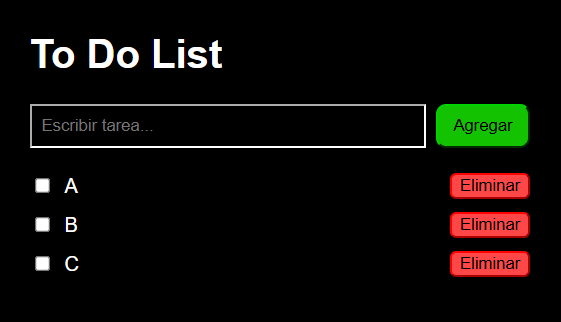

# 🖥️ Repositorio público "BPDS"

**Repositorio hecho para ser un entregable académico.**

> Nombre: Christian Buitrón
>
> Asignatura: Buenas Prácticas de Desarrollo de Software
> 
> Semestre: II
>
> Univerisdad de la Costa (CUC)

---

## 📌 READ ME PLS (Descripción)

El repositorio presente ha sido hecho con fines académicos y de aprendizaje para obtener habilidades y buen manejo de **Git** y **GitHub** respectivamente.

---

## 🔀 Ramas

Este mini proyecto consta de dos ramas:

- **master:** es la rama principal del repositorio donde se efectúan los cambios finales.
- **prod:** esta rama sirve para desarrollar y hacer cambios que luego irán hacia la rama principal (**master**).

---

## 📄 Contenido 

El contenido en sí es simple, siendo este un proyecto pequeño hecho con **NEXT.JS** llamado **"To Do List"** 
desarrollado principalmente con **JS** y **CSS** el cual permite conocer el manejo del **CRUD**.

## 👥 Grupo de trabajo

El grupo que maneja este repositorio está conformado por:

| Nombre | GitHub |
|---|---|
| Christian Buitrón | [@Chris-1209](https://github.com/Chris-1209) |
| Melissa Prins | [@molywii](https://github.com/molywii) |
| Juan Saucedo | [@LilRocket2303](https://github.com/LilRocket2303) |
| Edwin Alcendra | — |
---

## 📸 Captura de pantalla



---

## 🗂️ Estructura del proyecto

La estructura principal del repositorio es la siguiente:

```
bpds/
├── app/
│   ├── favicon.ico    # Icono de pestaña
│   ├── globals.css    # Estilos de la página
│   ├── layout.tsx     # Metadata
│   └── page.jsx       # Página funcional
├── public/
│   └── to-do-list.svg # Captura de pantalla
└── README.md          # Info
```

---

## 👋 Agradeciminetos

Agradezco mucho la lectura de este escrito para su revisión y comprensión,
este repositorio se irá actualizando a medida que avance el curso. Como siempre,
muchas gracias por tomarte el tiempo de leer esto.

Atte., Chris-1209.

---